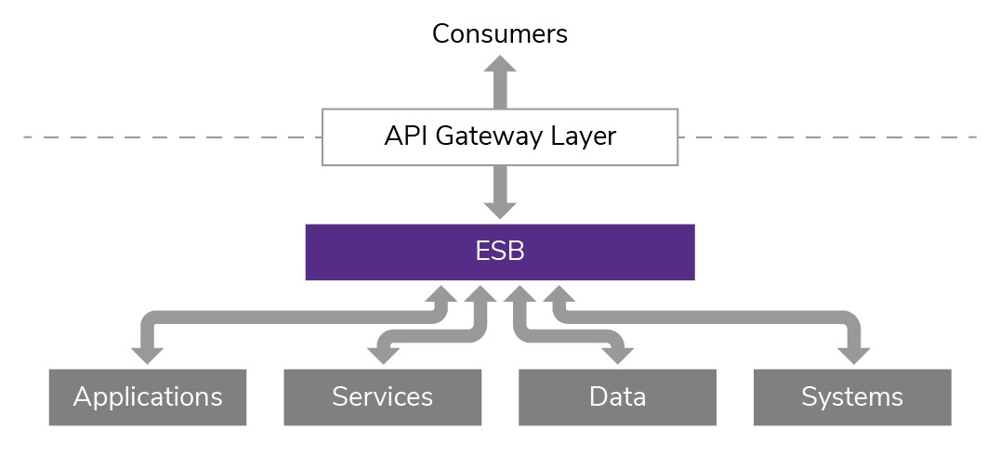

#Service Oriented Architechture(SOA)
---
The term **SOA** is an architectural pattern in computer software design in which application components provide services to other components via a communication protocol, typically over a network.
It is also termed as pattern for building Software Systems based on **loosely coupled Service Components**.

> 1. **Consumers** - It can be end user or any other service that make the request to access a particular service.

> 2. **API Gateway Layer** - It can be used for multiple purposes depending upon the need of the project. Some of them are as follows.
>  - Performing Validations
>  - Performing Security/Authentication operations
>  - Route User's request to appropriate service

> 3. **ESB** - It stands for Enterprise Service Bus, reffered to as *Backbone* of the System. Some responsibilities of ESB are mentioned below 
> - Providing Connectivity
> - Data Transformation (*mandatory*)
> - Routing (*mandatory*)
> - Service Management
> - Monitoring

> 4. **Services** - A service is a self-contained unit of software that performs a specific task.

---

### Principles of SOA

1. **Standard Service Contracts** - Services should have standard contracts exposing their functionalities to have a clear understanding of *exposed data*, *versioning*, *endpoints*, etc.

2. **Interoperability** - It is the ability to share information among the services efficiently.
   
3. **Composability** - It is the ability of *SOA* system to manage and perform complex operations.

4. **Abstraction** - It is a security level principle which states, Services should not expose technical details or Implementation to their *End Users*.
   
5. **Discoverability** - It explains the availability and calling of service whenever required.

---

### Areas of Application

There are 3 Major areas where *SOA* systems are widely used.

1. **Distributed Systems** - The demand for *SOA* rapidly increased with the use of complex Distributed System Network.

2. **Different Owners** - With the collaboration of Businesses more teams are involved in development of Software Systems.

3. **Heterogeneity** - *SOA* is Platform Independent design and helps multiple platforms to integrate efficiently. 

---

### Advantages
> - Reusability
> - Maintainability
> - Scalability
> - Platform Independence

---

### Limitations
> - Hard to manage Complex Service Management
> - Increased Overhead
> - Upfront Investment

---

##### Links Used for reference
- Video Description -  https://www.youtube.com/watch?v=jNiEMmoTDoE&t=137s

- Images - Accessed from Google Images

- Learning about SOA - https://en.wikipedia.org/wiki/Service-oriented_architecture
